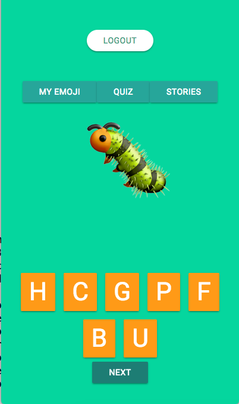
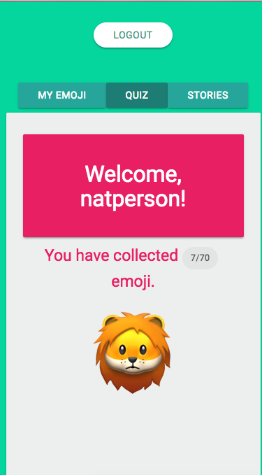

# Word Rumpus
> App that teaches children to spell and read
> (Galvanize Q3 group project)
> Contributers: Nathan Peterson, Lena Venable, Kyle Braden

# Demo at [https://wordrumpus.surge.sh](https://wordrumpus.surge.sh)

Toddlers are fascinated by mobile devices before they can even speak. Word Rumpus builds on this natural curiosity to introduce children to letters in a playful way.

### Gameplay:
* Users can collect emojis by spelling them correctly on a keyboard of random letters
* Correct and incorrect answers are indicated by animations
* Users can 'flip' the emoji to check the correct spelling of each word
* Users can use their collection of emojis to play with written stories, thus practicing their word recognition skills

### Technical Information:
* Front-end is built with React, backend is a RESTful API
* Login and sign up with Google profile via Auth0
* Express server, Knex queries, deployed on Heroku (back end) and Surge (front end)

### Next Steps:
* Adapt the interface to children who cannot read
* Add gameplay features
* Refine animations and optimize them for mobile use
